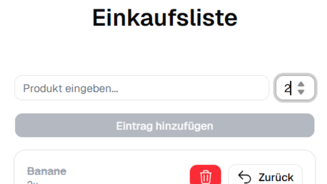

# Einkaufslisten-App



Eine Webanwendung zur digitalen Organisation und Optimierung des Wocheneinkaufs. Die App wurde als Single-Page-Application mit React und TypeScript umgesetzt. Sie ermöglicht es Benutzern, Produkte mit flexiblen Mengenangaben zu erfassen, wobei Duplikate automatisch verhindert werden. Erledigte Artikel werden an das Ende der Liste sortiert, können flexibel reaktiviert oder vollständig entfernt werden.

## Voraussetzungen
Für die lokale Ausführung und das Kompilieren des Projekts werden folgende Komponenten benötigt:
* Node.js (aktuelle LTS-Version)
* Ein moderner Webbrowser
* Git (optional, falls Sie das Repository klonen möchten)

## Technologien
* **HTML5:** Basis-Strukturierung der Einstiegsseite für das dynamische React-Root-Rendering im DOM-Knoten (`#root`).
* **TypeScript:** Typensichere Anwendungsarchitektur zur Definition klarer Datenstrukturen und Interfaces für Produkte, Kontext-Zustände, HTML-Element-Props sowie Komponenten-Schnittstellen.
* **React:** Komponentenbasiertes UI-Rendering, globale Zustandskontexte, Synchronisation von Seiteneffekten (`useEffect`, `useCallback`) und deklaratives Zustandsmanagement via Hooks (`useState`, `useMemo`).
* **Tailwind CSS (v4):** Modernste Frontend-Styling-Generation unter Nutzung der `@theme`-Direktive, des nativen `oklch()`-Farbraums für konsistente Farbdarstellungen sowie fortgeschrittener Container Queries und relationaler CSS-Selektoren.
* **Shadcn/ui & Radix UI:** Wiederverwendbare, barrierefreie UI-Komponenten auf Basis von Radix UI Primitives und der `class-variance-authority` (CVA).
* **Lucide React:** Paketierung moderner, konsistenter SVG-Vektorsymbole zur visuellen Benutzeroberflächen-Unterstützung.
* **Fontsource:** Einbindung der optimierten, variablen System-Schriftart **Geist Variable**.
* **Sonner:** Toast-Benachrichtigungs-Engine für reaktives und animiertes Benutzerfeedback bei Kassenaktionen.
* **Vite:** Front-End-Build-Tool für eine performante Entwicklungsumgebung und optimierte Produktions-Builds.

## Technische Funktionsweise

Die Anwendung basiert auf einer stark typisierten Client-Side-Architektur und implementiert folgende Kernkomponenten:

### Datenmodelle und Typsicherheit (`types.ts`)
Das Projekt nutzt TypeScript zur Gewährleistung der Datenintegrität über klar definierte Schnittstellen:
* `Product`: Definiert die Objektstruktur eines Artikels bestehend aus einer numerischen `id`, dem Produktnamen (`name`), der Mengenangabe (`amount`) und dem Erledigungsstatus (`checked`).
* `ProductListProps` & `ProductCardProps`: Strukturieren den abwärtsgerichteten Datenfluss (Props) und die Typisierung der Event-Handler für die Interaktionsschnittstellen.

### Zentrales Zustandsmanagement und Sortierlogik (`App.tsx`)
Die Zustandshaltung der Artikelliste wird zentral in der Hauptkomponente via `useState` verwaltet und mithilfe eines `useEffect`-Hooks persistent im `localStorage` unter dem Schlüssel `products` synchronisiert.
* **Duplikatsprüfung:** Beim Hinzufügen eines Artikels prüft eine `.some()`-Validierung case-insensitiv (`.toLowerCase()`), ob das Produkt bereits existiert. Bei einem Duplikat wird der Vorgang abgebrochen und eine rote Fehlermeldung via `sonner`-Toast ausgegeben.
* **Reaktive Positionsverschiebung:** Die Funktion `checkProduct(id)` invertiert den Status des gewählten Artikels. Wird ein Artikel abgehakt, wird er über eine Array-Filterung isoliert und an das Ende der Liste angehängt (`[...otherProducts, updatedProduct]`). Wird das Abhaken rückgängig gemacht, springt der Artikel wieder an die oberste Position der Liste.

### Globales Reaktiv-Theming und UX-Optimierung (`theme-provider.tsx` & `sonner.tsx`)
* **Stateful Context Provider:** Die App kapselt ihr visuelles Erscheinungsbild über eine native Context-API im Wahrnehmungsraum `oklch()`. Das System verarbeitet drei Hauptthemen (`dark`, `light`, `system`), überwacht Änderungen des Betriebssystems über Medienabfragen (`matchMedia`) und synchronisiert Zustände tabübergreifend mittels Browser-Storage-Events.
* **Tastatur-Hotkeys:** Ein globaler Keydown-Listener implementiert barrierefreie Abkürzungstasten. Ein Klick auf die Taste „D“ steuert außerhalb aktiver Formular-Eingabefelder eine unmittelbare Invertierung des Farbschemas.
* **Unterdrückung von CSS-Flackern:** Um fehlerhafte Rendering-Übergänge (Flash of Unstyled Content) beim Umschalten zu verhindern, blockiert eine Hilfsfunktion Übergangsanimationen mittels verschachtelter `requestAnimationFrame`-Zyklen temporär, bis die DOM-Klassenstruktur neu geordnet ist.
* **Integrierte Benachrichtigungs-Hierarchie:** Das Toast-System (`Toaster`) liest den aktiven Modus-Kontext aus, bindet spezifische Symbole von `lucide-react` ein und dockt das Styling über vordefinierte CSS-Variablen direkt an das Tailwind-Farbschema (`--normal-bg: var(--popover)`) an.

### Komponenten-Komposition und dynamische UI (`Card.tsx`, `Input.tsx` & `Button.tsx`)
* **Intelligente Komponenten-Kapselung:** Das System verwendet hochgradig anpassbare Shadcn/ui-Subkomponenten. Die `Card`-Komponente wertet über komplexe relationale Tailwind-Abfragen (`has-data-[]`, `has-[]`) die injizierten Kindelemente aus und passt Abstände (wie das Reduzieren des unteren Innenabstands bei Fußzeilen) automatisiert an. `CardHeader` nutzt Container Queries (`@container`), um Rasteranordnungen lokal statt bildschirmabhängig zu strukturieren.
* **Formular-Validierung und Barrierefreiheit:** Die `Input`-Komponente implementiert native Validierungsklassen für Barrierefreiheit und Fehlerzustände (`aria-invalid:`). Sie blockiert Fokusringe über strukturierte Schatten und steuert die Deaktivierung (`disabled:`) kontrastreich getrennt nach aktivem CSS-Thema.
* **Varianten-Management:** Die `Button`-Komponente verwendet `class-variance-authority`, um visuelle Zustände (wie `default`, `outline`, `destructive`) deklarativ zu steuern. Über das `asChild`-Pattern von Radix UI wird die Eigenschaftsvererbung auf Kindelemente ohne zusätzliche DOM-Knoten ermöglicht.

## Installation
Klonen Sie das Projekt auf Ihren lokalen Computer und installieren Sie die erforderlichen Abhängigkeiten über den Paketmanager:

```bash
# Repository klonen
git clone https://github.com

# In den Projektordner navigieren
cd einkaufsliste-app

# Abhängigkeiten installieren
npm install
```

## Nutzung
1. Starten Sie den lokalen Vite-Entwicklungsserver mit folgendem Befehl:
   ```bash
   npm run dev
   ```
2. Öffnen Sie die in der Konsole angezeigte lokale URL (Standard: `http://localhost:5173`) in Ihrem Webbrowser.
3. Nutzen Sie das linke Eingabefeld, um ein Produkt einzugeben, und passen Sie die gewünschte Anzahl über das numerische Mengenfeld (Minimum 1, Maximum 100) an.
4. Klicken Sie auf „Eintrag hinzufügen“ oder nutzen Sie die vordefinierten Eingabevalidierungen.
5. Drücken Sie optional die Taste **„D“** (außerhalb von Texteingaben), um manuell zwischen Light- und Dark-Mode zu wechseln.
6. Markieren Sie gekaufte Produkte über die Schaltfläche „Abhaken“, um diese ans Ende der Liste zu verschieben, oder entfernen Sie Positionen über die rote Löschschaltfläche dauerhaft aus dem Speicher.

## Deployment
Die Website kann direkt über GitHub Pages gehostet werden:
1. Gehen Sie auf GitHub in die Settings Ihres Repositories.
2. Klicken Sie im linken Menü auf Pages.
3. Wählen Sie unter Build and deployment den `main` (oder `master`) Branch aus und klicken Sie auf Save.
4. Nach wenigen Minuten ist die Website live unter Ihrer GitHub-Pages-URL erreichbar.

## Mitwirken
Da dies ein persönliches Projekt oder Portfolio-Projekt ist, werden aktuell keine Pull Requests oder externen Code-Beiträge entgegengenommen. Feedback oder Fragen können Sie mir jedoch gerne per E-Mail senden.

## Lizenz
Dieses Projekt wurde von Xenia Wilczek erstellt. Alle Rechte an Code und Design vorbehalten (All Rights Reserved).
